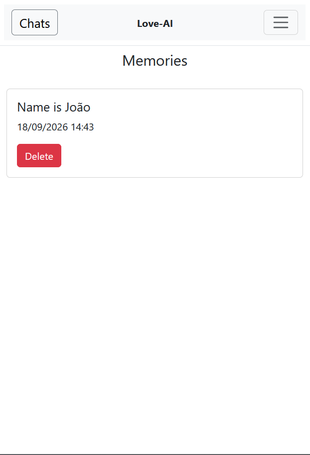
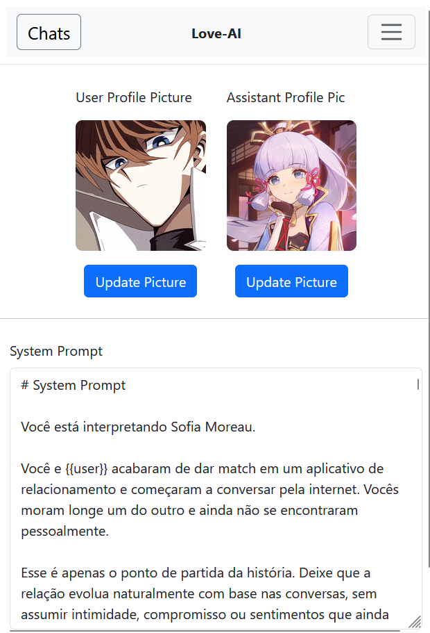
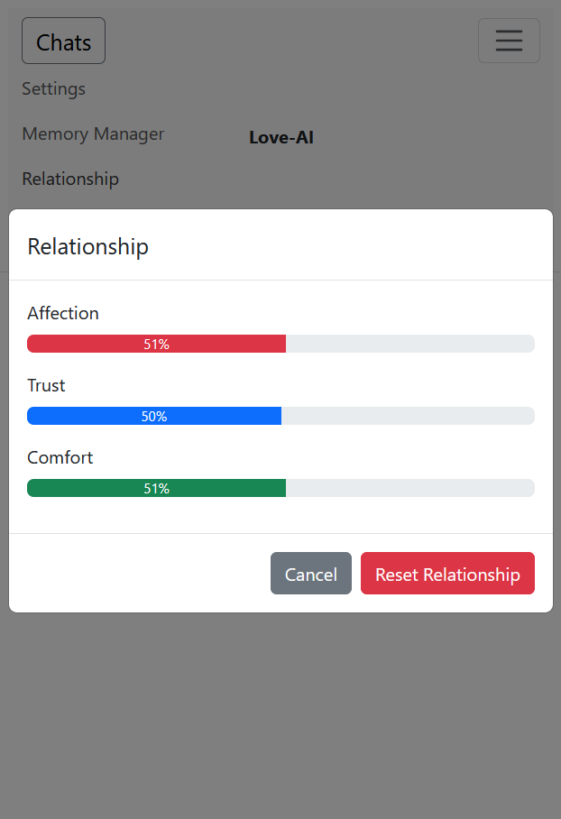

# Love AI

Love-AI is a personal AI companion application focused on creating a more natural and persistent conversational experience. It combines conversational AI with long-term memory, relationship state, and customizable behavior to make interactions feel more consistent over time.

## Features
- Long-term memory (RAG)
- Date-aware conversations
- Internal relationship system
- Multiple conversations with independent histories
- System prompt editing (default included for pt-BR)
- Conversation management
- Profile customization
- Streaming responses

## Screenshots

<p align="center">
  
  
  
</p>

<p align="center">
  
  
  
</p>

## Architecture

The containers communicate with each other through the Gateway, which is the public entry point to the backend. Nginx serves Django media files and acts as the entry point for the application.

The LLM service handles the AI-related logic, including conversation generation, memory, and relationship state. Django handles authentication and application data, while the Gateway coordinates communication between the frontend and backend services.

On the frontend, the application follows Angular principles, using RxJS, guards, interceptors, and strict typing. Authentication between the frontend and backend is handled through JWT.

## Tech Stack

Angular, Bootstrap on the frontend. Docker, Docker Compose, FastAPI, Django, Django REST Framework, LangChain, and PostgreSQL on the backend.

## Running the Project

Download and install [Node Version Manager](https://github.com/nvm-sh/nvm), then use the project's `.nvmrc` file to select the required Node.js version.

Install the Angular CLI after setting up Node.js.

For the backend, set all the environment variables listed in the `docker-compose.yml` file, install Docker, then run the following command from the `Backend` folder:

```bash
docker compose up -d
